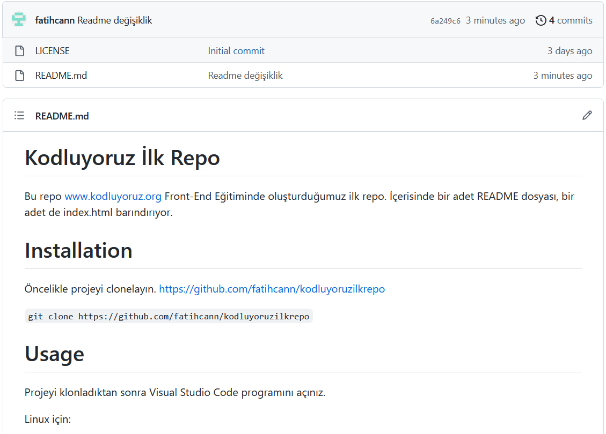

# Kodluyoruz İlk Repo

Bu repo www.kodluyoruz.org Front-End Eğitiminde oluşturduğumuz ilk repo. İçerisinde bir adet README dosyası, bir adet de index.html barındırıyor.




# Installation
Öncelikle projeyi clonelayın. https://github.com/fatihcann/kodluyoruzilkrepo

`git clone https://github.com/fatihcann/kodluyoruzilkrepo`

# Usage

Projeyi klonladıktan sonra Visual Studio Code programını açınız.

Linux için:

```
cd kodluyoruzilkrepo
code .
```

# Contributing

Pull requestler kabul edilir. Büyük değişiklikler için lütfen neyi değiştirmek istediğinizi belirten bir konu açın.

# Licence

[MIT](https://choosealicense.com/licenses/mit/)

